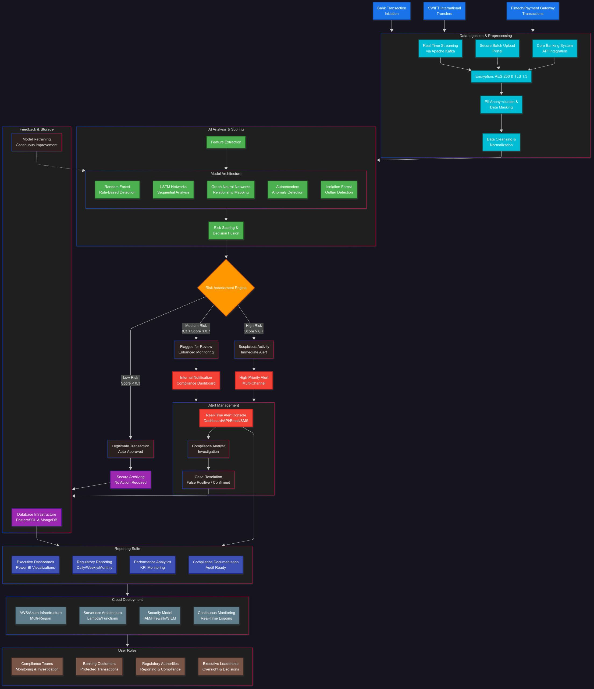
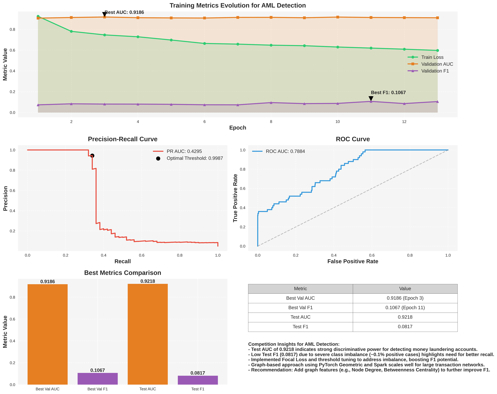
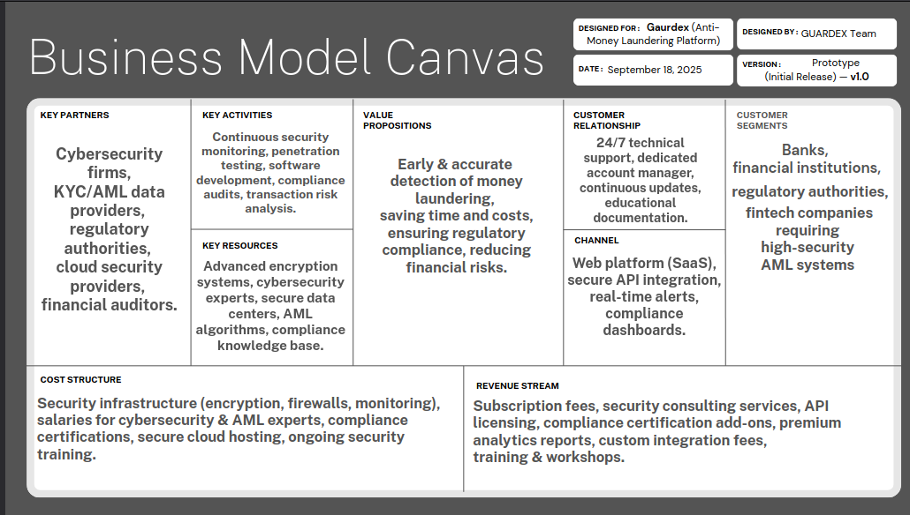

# 🚀 AML Detection with Graph Attention Networks

<div align="center">


*Advanced Anti-Money Laundering detection system using Graph Attention Networks and AI-powered analytics*

</div>

## 📋 Table of Contents
- [🌟 Overview](#overview)
- [🔀 System Workflow](#system-workflow)
- [⚡ Quick Start](#quick-start)
- [🔧 Installation & Setup](#installation--setup)
- [🚀 Usage](#usage)
- [🏗️ Project Structure](#project-structure)
- [🛠️ Technologies Used](#technologies-used)
- [🧠 Model Details](#model-details)
- [📊 Performance Metrics](#performance-metrics)
- [💼 Business Model](#business-model)
- [📊 API Endpoints](#api-endpoints)
- [🤝 Contributing](#contributing)
- [📄 License](#license)

## 🌟 Overview

This project implements a comprehensive **Anti-Money Laundering (AML) detection system** that leverages cutting-edge **Graph Attention Networks (GAT)** with PyTorch Geometric and PySpark for scalable graph-based analysis. The system combines multiple AI-powered modules to provide robust money laundering detection capabilities.

### 🎯 Key Features

- **🤖 AI-Powered Transaction Analysis** - Isolation Forest for anomaly detection
- **🕸️ Network Analysis** - Graph-based pattern detection using NetworkX
- **🎯 Advanced Pattern Recognition** - ML-driven detection of complex money laundering patterns
- **⚖️ Risk Scoring Engine** - Multi-factor risk calculation
- **📊 Real-time Dashboard** - Interactive visualization and reporting
- **🔗 RESTful API** - Seamless integration capabilities

## 🔀 System Workflow

<div align="center">

### Complete System Flowchart


</div>

## ⚡ Quick Start

### 🚀 Get Started in 5 Minutes

```bash
# 1. Clone the repository
git clone https://github.com/YousefAbdalbary/Digitopia_AML_project.git
cd Digitopia_AML_project

# 2. Install dependencies
pip install -r requirements.txt

# 3. Train the model
python model/train_model.py

# 4. Start the services
python app.py

### 📁 Sample Data Structure

```python
# Example transaction data format
{
    "transaction_id": "txn_001",
    "from_account": "acc_123",
    "to_account": "acc_456", 
    "amount": 15000.0,
    "currency": "USD",
    "timestamp": "2025-09-29 10:00:00",
    "from_bank": "1001",
    "to_bank": "1002",
    "payment_format": "wire"
}
```

## 🔧 Installation & Setup

### 📋 Prerequisites

- Python 3.8+
- MongoDB 4.4+
- Java 8+ (for PySpark)
- CUDA 11.0+ (for GPU acceleration)

### ⚙️ Installation Steps

1. **Create Virtual Environment**
   ```bash
   python -m venv aml_env
   source aml_env/bin/activate  # Linux/Mac
   # OR
   aml_env\Scripts\activate    # Windows
   ```

2. **Install Dependencies**
   ```bash
   pip install -r requirements.txt
   ```

3. **Environment Configuration**
   ```bash
   cp config.example.py config.py
   # Edit config.py with your settings
   ```

4. **Database Setup**
   ```python
   from services.data_processor import DataProcessor
   from pymongo import MongoClient
   
   client = MongoClient("mongodb://localhost:27017/")
   db = client["aml_database"]
   processor = DataProcessor(db)
   ```

## 🚀 Usage

### 🧠 1. Train the GAT Model

```bash
python model/train_model.py
```

**Output Artifacts:**
- `./spark_pipeline_model` - Spark feature engineering pipeline
- `./best_gat_neighbor_gpu.pth` - Trained model weights
- `./account2idx.json` - Account to index mapping

### 🔍 2. AI-Powered Transaction Analysis

```python
from services.ai_analyzer import AIAnalyzer

# Initialize analyzer
analyzer = AIAnalyzer()

# Train on transaction data
transactions = pd.read_csv("data/transactions.csv")
analyzer.train_model(transactions)

# Save model for production
analyzer.save_model("models/ai_analyzer_model.pkl")
```

### 💾 3. Data Processing & Analytics

```python
from services.data_processor import DataProcessor

processor = DataProcessor(db)

# Get real-time dashboard statistics
dashboard_stats = processor.get_dashboard_stats()

# Geographic cash flow analysis
cash_flow = processor.get_geographic_cash_flow()

# Account-level reporting
reports = processor.generate_account_reports()
```

### 🕸️ 4. Network Analysis

```python
from services.network_analyzer import NetworkAnalyzer

analyzer = NetworkAnalyzer(db)

# Analyze account connections
network_data = analyzer.get_network_data(
    focus_account="acc123", 
    depth=2, 
    min_amount=1000
)

# Calculate network risk
risk_score = analyzer.calculate_network_risk_score("acc123")
```

### 🎯 5. Advanced Pattern Detection

```python
from services.advanced_pattern_analyzer import create_pattern_analyzer

analyzer = create_pattern_analyzer()
transactions = list(db.transactions.find())

# Detect complex patterns
patterns = analyzer.analyze_patterns(transactions)

# Get pattern summary
summary = analyzer.get_pattern_summary(patterns)
```

### ⚖️ 6. Risk Calculation

```python
from services.risk_calculator import RiskCalculator

calculator = RiskCalculator()

# Single transaction risk
transaction = {
    'amount_received': 15000,
    'receiving_currency': 'USD', 
    'timestamp': '2025-09-29 10:00:00',
    'from_bank': '1001',
    'to_bank': '1002',
    'payment_format': 'wire'
}

risk_score = calculator.calculate_transaction_risk(transaction)
explanation = calculator.get_risk_explanation(transaction, risk_score)
```

### 🌐 7. Backend API Server

```bash
# Start Flask application
python app.py

# Server running at http://localhost:5000
```

## 🏗️ Project Structure

```
Digitopia_AML_project/
├── 📁 model/                     # Machine learning models
│   ├── train_model.py            # Main model training script ✅
│   └── saved_models/             # Trained model artifacts
├── 📁 services/                  # Core business logic
│   ├── ai_analyzer.py            # AI-powered transaction analysis
│   ├── data_processor.py         # Data processing & analytics
│   ├── network_analyzer.py       # Network graph analysis
│   ├── advanced_pattern_analyzer.py # Advanced pattern detection
│   └── risk_calculator.py        # Risk scoring engine
├── 📁 static/                    # Frontend assets
│   ├── js/                       # JavaScript files
│   ├── css/                      # Stylesheets
│   └── images/                   # Images and icons
├── 📁 templates/                 # HTML templates
├── 📁 tests/                     # Test suites
├── 📁 uploads/                   # File upload directory
├── flowshart.jpg                 # System workflow diagram ✅
├── buisness_model_canvas.png     # Business model canvas ✅
├── presentation_metrics_plot.png # Presentation metrics ✅
├── aml_competition_metrics.png   # Competition metrics ✅
├── logo.jpg                      # Project logo ✅
├── app.py                        # Flask application entry point
├── config.py                     # Configuration settings
└── requirements.txt              # Python dependencies
```

## 🛠️ Technologies Used

### 🤖 Machine Learning & AI

| Technology | Purpose | Version |
|------------|---------|---------|
| PyTorch Geometric | Graph Neural Networks | 2.0+ |
| PySpark | Big Data Processing | 3.0+ |
| Scikit-learn | Traditional ML | 1.0+ |
| NetworkX | Graph Analysis | 2.6+ |

### 💻 Backend & Database

| Technology | Purpose |
|------------|---------|
| Flask | REST API Framework |
| MongoDB | Document Database |
| PyMongo | MongoDB Driver |
| Requests | HTTP Client |

### 📊 Data Science

| Technology | Purpose |
|------------|---------|
| Pandas | Data Manipulation |
| NumPy | Numerical Computing |
| Matplotlib | Visualization |
| Jupyter | Interactive Analysis |

## 🧠 Model Details

### 🎯 Graph Attention Network (GAT)

**Architecture:**
```python
GATModel(
  (conv1): GATConv(64, 32, heads=4)
  (conv2): GATConv(128, 64, heads=2) 
  (classifier): Linear(64, 2)
)
```

**Training Script:** `model/train_model.py` ✅

**Key Features:**
- ✅ Multi-head attention mechanism
- ✅ Neighborhood sampling for scalability
- ✅ GPU acceleration support
- ✅ Dynamic graph learning

### 🔍 AI Analyzer

**Detection Methods:**
- 🎯 Isolation Forest for anomaly detection
- 📊 DBSCAN clustering for pattern recognition
- 📈 Rule-based risk scoring
- 🔄 Real-time transaction monitoring

### 🕸️ Network Analyzer

**Metrics Calculated:**
- 🔗 Betweenness Centrality
- 📍 Closeness Centrality  
- 🏆 PageRank
- 🎯 Degree Centrality

## 📊 Performance Metrics

<div align="center">


### Competition Evaluation Results


</div>

## 💼 Business Model

<div align="center">

### Business Model Canvas


</div>

## 📊 API Endpoints

### 🔗 Core Endpoints

| Endpoint | Method | Description | Parameters |
|----------|--------|-------------|------------|
| `/api/predict` | POST | GAT model predictions | `transaction_data` |
| `/api/analyze` | POST | AI analysis results | `transactions` |
| `/api/network` | GET | Network analysis | `account_id`, `depth` |
| `/api/patterns` | POST | Pattern detection | `transaction_batch` |
| `/api/risk` | POST | Risk scoring | `transaction_data` |

### 📈 Dashboard Endpoints

| Endpoint | Method | Description |
|----------|--------|-------------|
| `/api/dashboard/stats` | GET | Real-time statistics |
| `/api/dashboard/alerts` | GET | Current alerts |
| `/api/dashboard/reports` | GET | Generated reports |

### 💡 Example API Usage

```python
import requests

# Get network analysis for account
response = requests.get(
    "http://localhost:5000/api/network",
    params={"account_id": "acc123", "depth": 2}
)

# Calculate transaction risk
risk_data = {
    "transaction": transaction_dict,
    "account_history": account_data
}
response = requests.post("http://localhost:5000/api/risk", json=risk_data)
```

## 🤝 Contributing

We welcome contributions! Please see our contributing guidelines:

### 🛠️ Development Setup

1. **Fork the repository**
2. **Create a feature branch**
   ```bash
   git checkout -b feature/amazing-feature
   ```
3. **Commit your changes**
   ```bash
   git commit -m 'Add amazing feature'
   ```
4. **Push to the branch**
   ```bash
   git push origin feature/amazing-feature
   ```
5. **Open a Pull Request**

### 🧪 Testing

```bash
# Run all tests
python -m pytest tests/

# Run specific test module
python -m pytest tests/test_models.py

# With coverage report
python -m pytest --cov=services tests/
```

### 📝 Code Standards

- Follow PEP 8 style guide
- Use type hints for all functions
- Write docstrings for all public methods
- Include tests for new features

## 📄 License

This project is developed for the Digitopia competition and is licensed under the MIT License.

---

<div align="center">

**Built with ❤️ for the Digitopia Competition**


</div>
```

